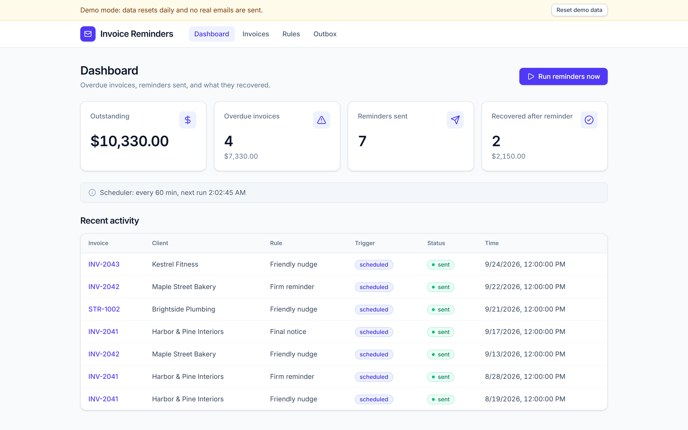
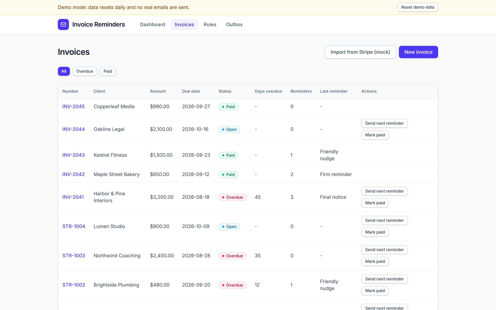
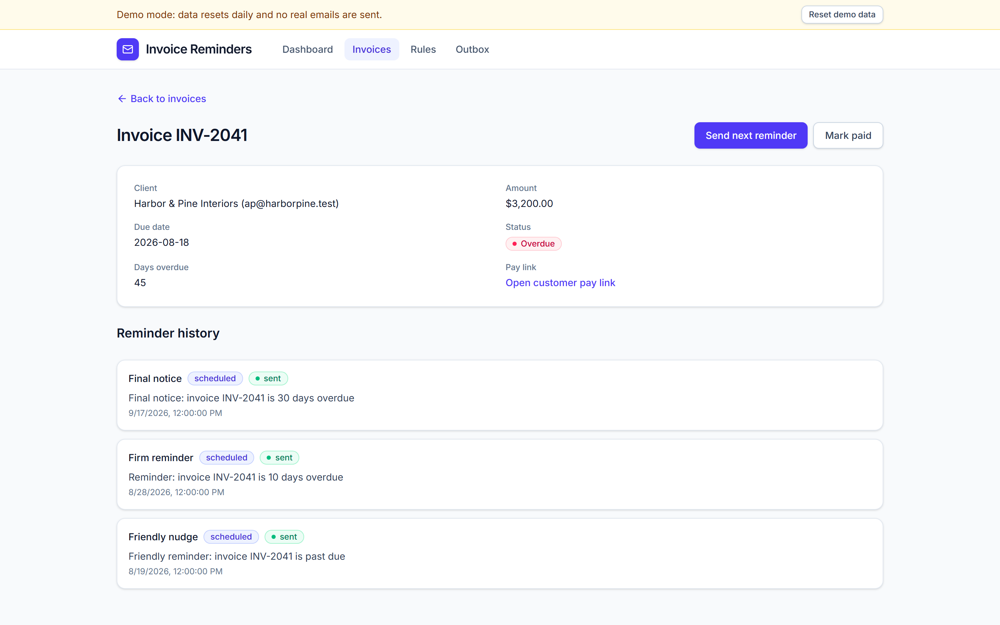
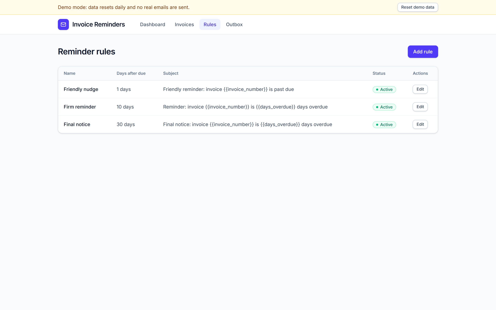
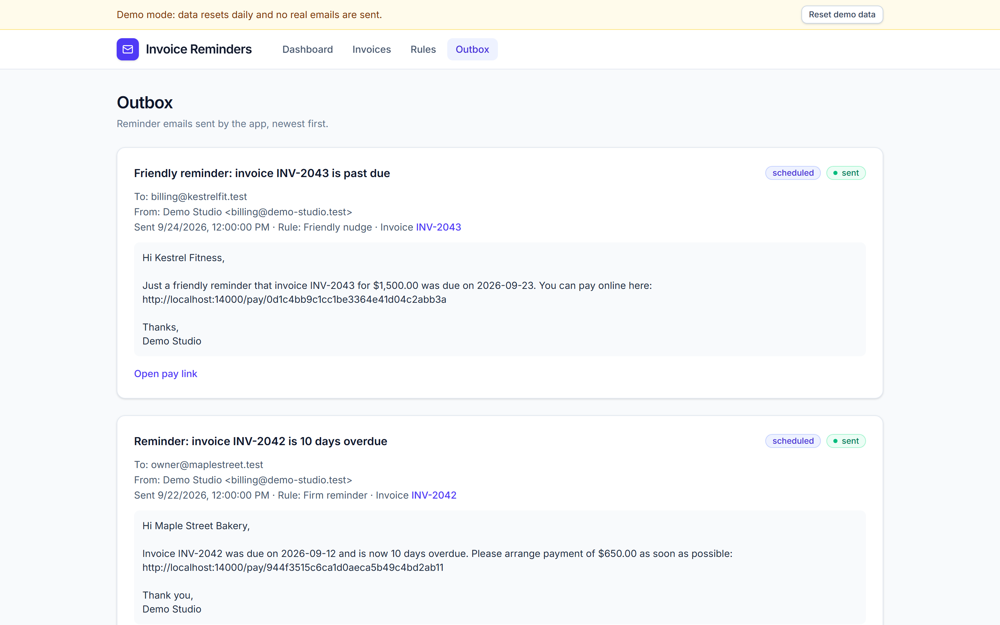
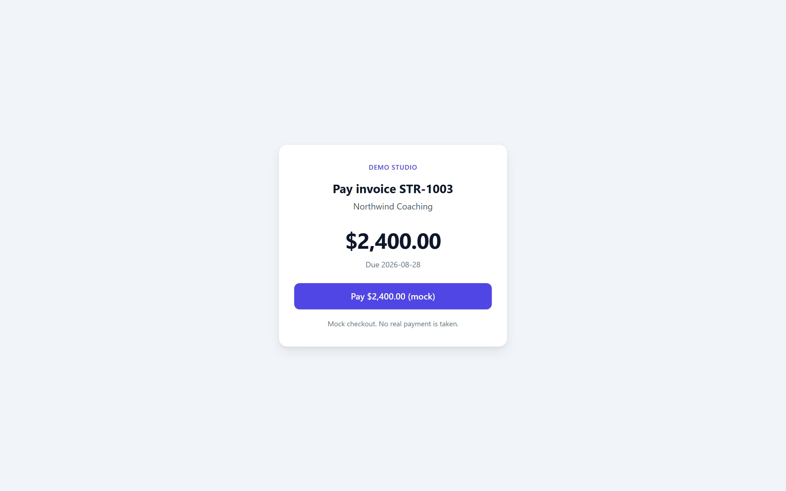
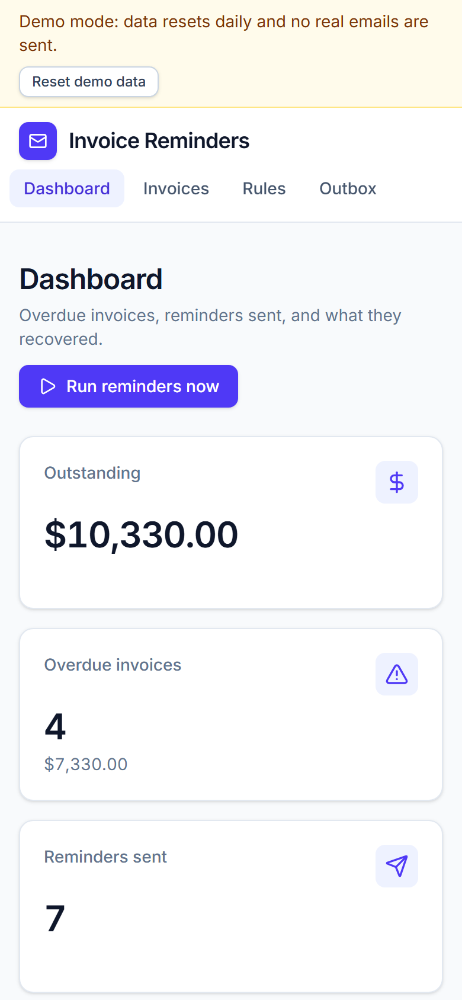
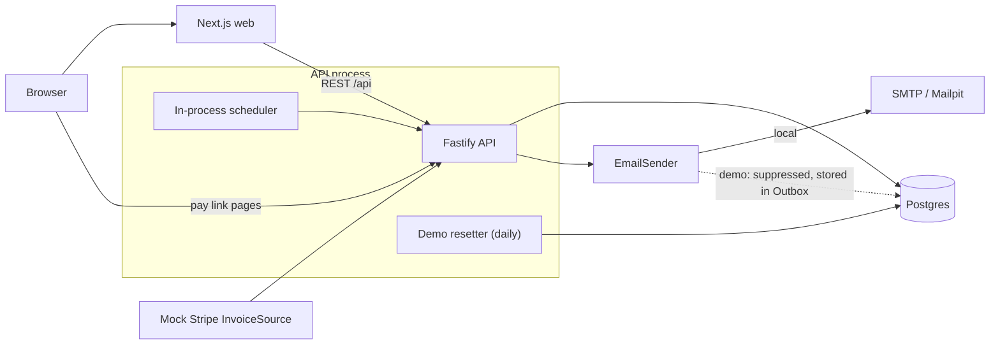

# Invoice Reminders

A small web app that chases late invoices for you. Import overdue invoices, define escalating reminder rules (1, 10 and 30 days after the due date by default: Friendly nudge, Firm reminder, Final notice), and the app sends the right email at the right time, tracks every reminder, and gives the customer a pay link that marks the invoice paid. It is a portfolio proof of concept: Next.js frontend, Fastify and Postgres backend, fully containerised, with a public demo mode that resets itself daily.

Live demo: TODO (add Render URL)
Demo video: TODO (add link)



## The problem

Late payments are a cash flow problem for small businesses and freelancers. According to [Clockify's late invoice statistics](https://clockify.me/late-invoice-statistics):

- Only 52% of B2B invoices are paid on time.
- 43% of the value of credit-based B2B sales is overdue.
- US small businesses are owed more than $17,000 in overdue invoices.
- Slightly less than a third of freelancer invoices are late.
- Freelancers spend more than one full workday per month chasing late payments.

Automated, rule-based reminders remove most of that manual chasing.

## Features

- Dashboard cards for Outstanding, Overdue invoices, Reminders sent, and Recovered after reminder (invoices paid after a reminder went out), a recent activity feed, and a "Run reminders now" button.
- Invoice list and detail pages with the full reminder history per invoice.
- Reminder rules: configurable timing (1 to 365 days after the due date), with editable subject and body templates.
- In-process scheduler: each scheduled run sends at most one email per invoice, picks the escalation step that matches how overdue it is, and never repeats a step it already sent, so running twice on the same day sends nothing new.
- Mock Stripe import of overdue invoices (through an `InvoiceSource` interface) plus manual invoice creation.
- Pay link per invoice: a hosted pay page, served by the API, that marks the invoice paid.
- Email through SMTP (Mailpit locally) behind an `EmailSender` interface; plain-text emails.
- In-app Outbox that shows what was (or would have been) sent.
- Demo mode for safe public hosting (see [Demo mode](#demo-mode)).

## Screenshots

| | |
|---|---|
|  |  |
| Dashboard | Invoice list |
|  |  |
| Invoice detail with reminder history | Reminder rules |
|  |  |
| Outbox | Customer pay page |

Mobile dashboard:



## Architecture



- The API owns all business logic and runs migrations at startup.
- The scheduler and the demo resetter run inside the API process, so the API must run as a single instance.
- Pay link pages are rendered by the API itself, so a customer never needs the web app.

## Tech stack

| Layer | Technology |
|---|---|
| Frontend | Next.js 15, React 19, TypeScript |
| Backend | Fastify 5, TypeScript (run with tsx), zod, nodemailer, pg |
| Database | Postgres 16 |
| Tests | Vitest (backend, against a real Postgres) |
| Local email | Mailpit |
| Packaging | Docker, Docker Compose |
| Deploy | Render Blueprint (`render.yaml`) |

## Run locally

Requires Docker with Compose.

```bash
docker compose up -d --build --force-recreate --wait
```

| Service | URL |
|---|---|
| Web app | http://localhost:13000 |
| API | http://localhost:14000 (health: `/api/health`) |
| Mailpit inbox | http://localhost:18025 |
| Postgres | `localhost:15432` |

Reminder emails sent locally show up in Mailpit. Stop everything with:

```bash
docker compose down
```

Add `-v` to also delete the database volume. `.env.example` lists the variables used by the tests and local tooling.

## Run the tests

Backend tests run against a real Postgres, so start the database container first:

```bash
docker compose up -d --wait db
cd backend
npm install
npm test
```

Other checks:

```bash
cd backend && npm run typecheck
cd web && npm install && npm run typecheck && npm run build
```

The screenshots in `docs/screenshots/` are produced by a script (the app must be running in demo mode on the local ports):

```bash
cd web
npm run screenshots:install-browser   # one-time browser download
npm run screenshots
```

## Demo mode

`DEMO_MODE=true` makes the app safe to expose publicly:

- A banner on every page says data resets daily and no real emails are sent, with a "Reset demo data" button.
- Demo data is reset once a day (also checked on API startup, so a sleeping host resets on wake-up) back to a seeded set of invoices and reminders.
- Email is suppressed: reminders are recorded and shown in the in-app Outbox instead of being delivered.
- Write rate limits per IP, request body limits, and caps on the number of invoices and rules.

Run it locally with the demo override file, which uses a separate database (`invoice_reminders_demo`) so your normal local data is never reset:

```bash
docker compose -f docker-compose.yml -f docker-compose.demo.yml up -d --build --force-recreate --wait
```

Then open http://localhost:13000. Go back to the normal setup by running `docker compose down` and the plain `up` command above.

## Deploy to Render

The repo includes a Render Blueprint (`render.yaml`) that creates a Postgres database, the API and the web app, all in demo mode. First deploy:

1. Push this repository to your own GitHub account.
2. Create a Render account and connect it to GitHub.
3. In the Render dashboard choose New > Blueprint and select the repository.
4. Render asks for three values, which are URLs you do not know yet. Use the predicted ones (if the names are free):
   - `PUBLIC_API_URL`: `https://invoice-reminders-api.onrender.com`
   - `WEB_ORIGIN`: `https://invoice-reminders-web.onrender.com`
   - `NEXT_PUBLIC_API_URL`: `https://invoice-reminders-api.onrender.com`
5. Apply the Blueprint and wait for the database and both services to finish deploying.
6. Open each service in the dashboard and compare its real URL with step 4. If Render added a suffix, correct the three variables, redeploy the API, and rebuild the web service (`NEXT_PUBLIC_API_URL` is baked in at build time, so use Manual Deploy > Clear build cache & deploy).
7. Verify: `<api url>/api/health` returns `"db":"ok"`, and the web URL shows the demo banner.
8. Put the web URL into the "Live demo" line at the top of this file.

Details, all environment variables and caveats are in [docs/deployment.md](docs/deployment.md).

Note: Render free-tier limits (sleep after inactivity, database expiry, Blueprint field names) are unverified in this repo. The config has only been validated locally. Check Render's current docs and pricing before deploying.

## Limitations

- No authentication or multi-tenancy: anyone with the URL can use and change the data. That is why the public deployment runs in demo mode.
- The Stripe import and the pay page are mocks; no real payments or real Stripe API calls.
- Single API instance only, because the scheduler, the demo resetter and the rate limiter are in-process.
- Emails are plain text.
- Not deployed from this repository yet; the Render setup is validated locally only.

## Next steps

- Authentication and per-account tenants.
- Real Stripe, QuickBooks or other accounting integrations behind the existing `InvoiceSource` interface.
- A real email provider (Resend or Postmark) with SPF and DKIM set up, plus HTML templates.
- Run the scheduler from an external cron or guard it with a database lock so the API can scale beyond one instance.
- Real payment collection on the pay page.
- Optional SMS reminders for high-value invoices.

## How this was built

Built with an AI agent team (Claude Code) working from a written spec and a verified task list; each task had to pass an automated check before moving on.
